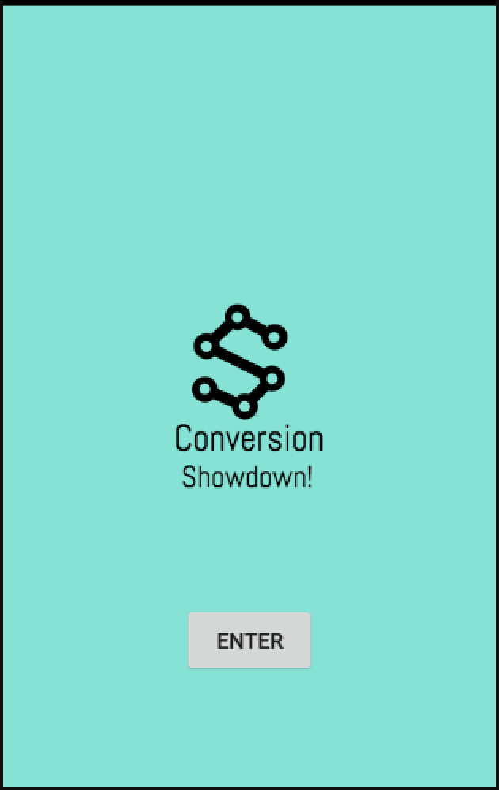
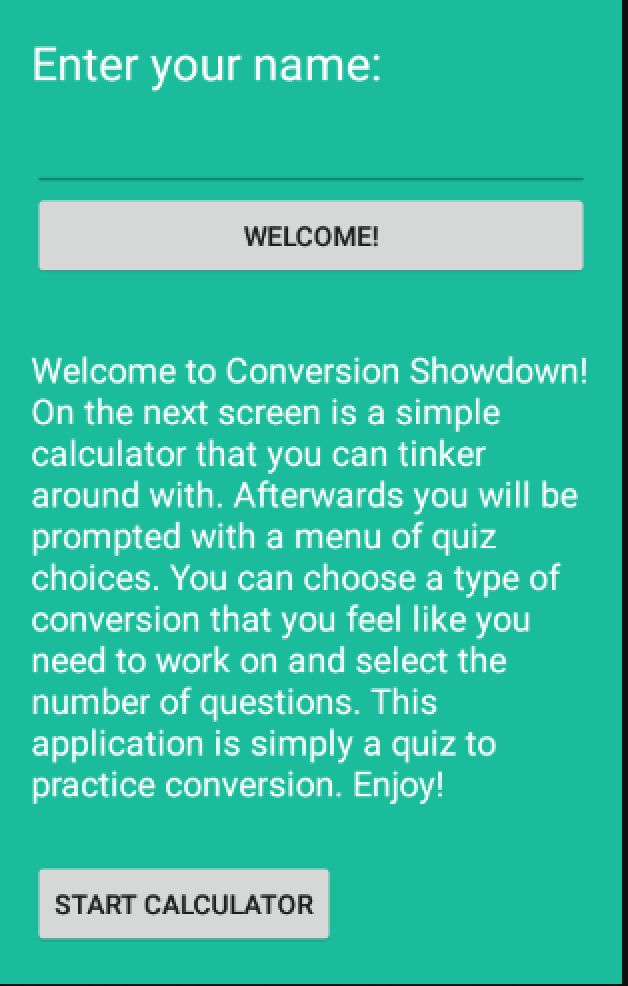
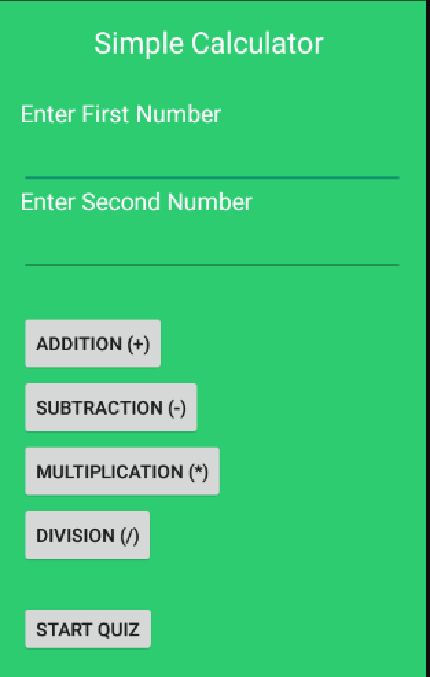
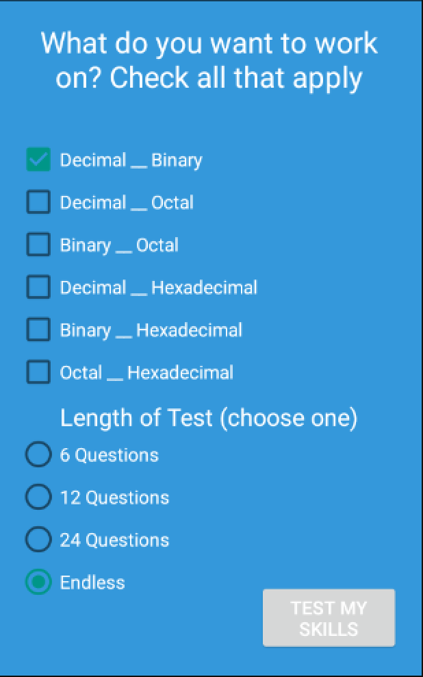
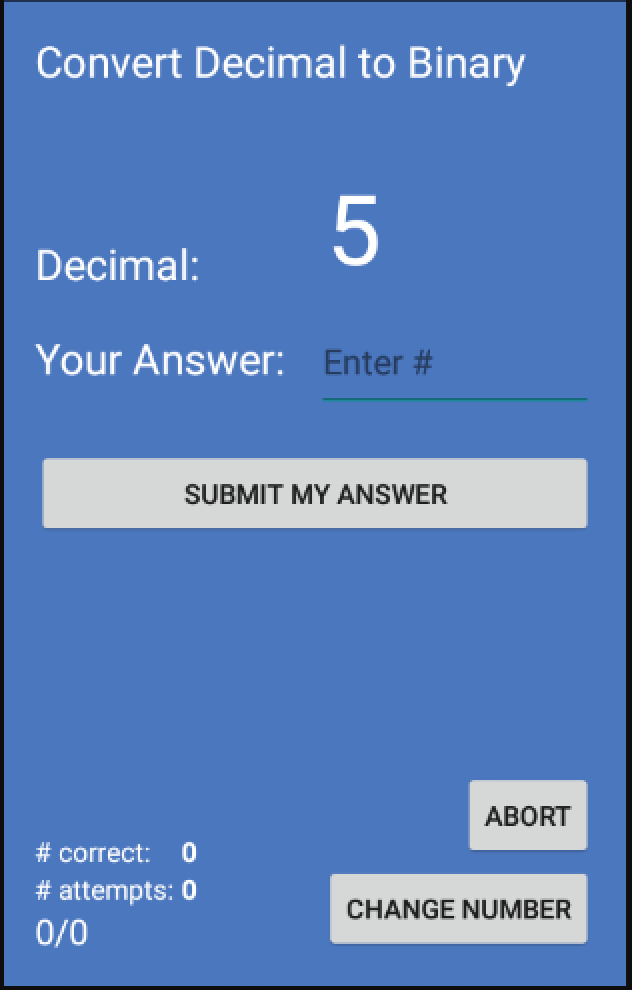
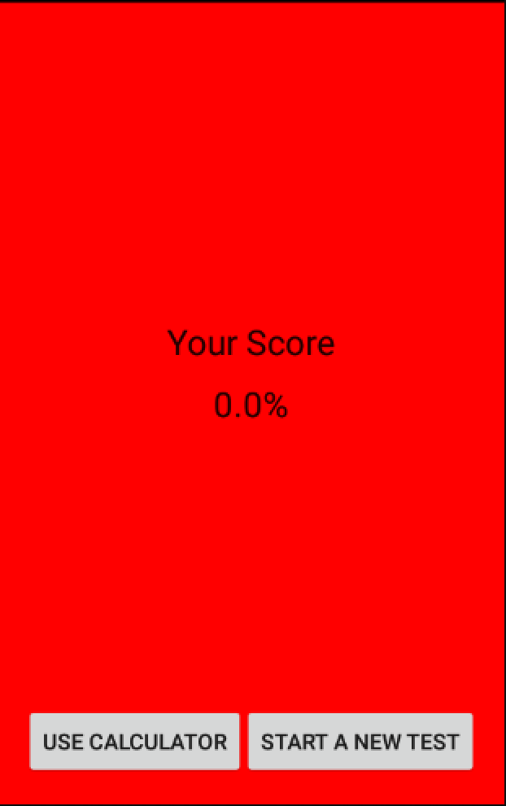

# cs56-android-quiz

## W16 Final Remarks

This is an Android application. To get started, you should familiarize a little bit with Android Studio and all the components that make up an Android application (ie. Manifest, XML files, Activities, etc.) The entirety of this application is described below in this README.md. We have got a full runnning implementation of the following tests: Decimal to Binary, Binary to Decimal, Decimal to Octal, Octal to Decimal, Binary to Octal, Octal to Binary, Hexadecimal to Decimal, Hexadecmial to Binary, and Hexadecimal to Octal. The Tests that work partially are Decimal to Hexadecimal, Binary to Hexadecimal, and Octal to Hexadecimal. These three test work only if the Hex number entered by the user does not have letters (even Hex letters) in the answer. Some things that can be added on could be graphics/animations, a splash screen, and transitions between activities to make the application even more enjoyable. Also when git cloning this repository, an error would occur. It is because the SDK on my personal computer is different from yours. Android Studio should fix the problem itself. A screenshot of the error is located in this file: error.jpg. A few bugs that exist currently are: 

## Brief Update March 3rd, 2016

Fixed if button was pressed, no input was given, application would crash. Implemented a percentage score for quiz. Revamped README.md. 
## Project History

| Details      | -              | -                  |
| -------------|----------------|--------------------|
| Creators     | Henry Yu       | Phillip Fry        |
| Instructors  | Phillip Conrad | Allison Shedded    |
| Winter 2016  | CS 56          | UCSB               |

## What is This?

This is a "made from scratch" Android Application built with Android Studio. It contains a simple calculator followed by a selection of number conversion quizzes. This is a legacy code project for an undergraduate computer science course at the University of California, Santa Barbara. The project stems from an already existing project written in Java: https://github.com/UCSB-CS56-Projects/cs56-math-conversion-quiz

## Goal

The ultimate goal of this project is to translate the entirety of the old Java Application Project into an Android Application. The old Java Application contains binary conversion (from any radix to binary), decimal conversion (from any radix to decimal), octal conversion (from any radix to octal), hexadecimal conversion (from any radix to hexadecimal), random conversion (the default mode, from any radix to any radix), and a masking conversion (only with binary).

## How to Run?

Download the lastest version of Android Studio at the following link: http://developer.android.com/sdk/index.html. Git clone this repository and open the project folder inside Android Studio and running it should be smooth. Make sure you have the latest SDK installed and updated.

## How does the Application Work?

Run the app by clicking Run on Android Studio. Choose any Android Device as your emulator and the application should start. You will be prompted with a welcome screen, after which you are invited to type in your name and a welcome message will be displayed. Next screen is a simple calculator you can play around with. Following is the quiz itself, which contains checkboxes for the types of conversions (ie. Decimal to Binary or Octal to Hexadecimal) and radio buttons for the length of the quiz (ie. 6 questions, 12 questions, etc.) You will then be prompted with the quiz interface itself, where a number is given and the user will be prompted to type in the correct conversion. A "Change Number" feature is added if the current problem is too difficult. A "Percentage" feature has also been implemented to tell the user how well they are doing as they are progressing throughout the quiz. 

## Screenshots

@TODO
Screenshots of the running Application goes here.  

!Alt tag](https://github.com/henryhyu/android-quiz/blob/master/EntryScreen.PNG)
!Alt tag]()
!Alt tag]()
!Alt tag]()
!Alt tag]()
!Alt tag]()
!Alt tag]()
!Alt tag]()

## Legacy Code Issues

@TODO
Will be present in the "Issues" tab of this repository. https://github.com/henryhyu/android-quiz/issues

## Project Point Distribution

| Points       | Topic                                                          | Driver/Nagivator |
| -------------|----------------------------------------------------------------|------------------|
|  150         |  README.md                                                     | H.Y./P.F.        |
|  100         |  Learning Android                                              | H.Y./P.F.        |
|  50          |  Graphical Welcome Screen (1st Activity)                       | H.Y./P.F.        |
|  75          |  Introduction Screen (2nd Activity)                            | H.Y./P.F.        |
|  100         |  Calculator (3rd Activity)                                     | H.Y./P.F.        |
|  100         |  Quiz Selection Screen (4th Activity)                          | P.F./H.Y.        |
|  250         |  (Initial) Binary to Decimal Conversion (5th Activity)         | P.F./H.Y.        |
|  100         |  Decimal to Octal                                              | P.F./H.Y.        |
|  100         |  Binary to Octal                                               | P.F./H.Y.        |
|  50          |  Decimal to Hex, Binary to Hex, Octal to Hex                   | P.F./H.Y.        |
|  75          |  Score Report (6th Activity)                                   | P.F./H.Y.        |
|  100         |  Basic App Logic/Structure (Quality Assurance)                 | H.Y./P.F.        |
|  50          |  Transparency for the written code via Comments                | P.F./H.Y.        |
|  100         |  Front End Aesthetics                                          | H.Y./P.F.        |
| Total        |  1400 Points                                                   | -                |

## Activity Descriptions:

Learning Android Explanation: Beginning the app/learning how android studio works in regards to activities/manifest/xml

Graphical Welcome Screen (1st Activity): Landing page welcome screen with designed logo and button that directs user to the next page.

Introduction Screen (2nd Activity): Introduction page that welcomes the user when the name is inputted. Directions are given and a button directs user to the next page.

Calculator (3rd Activity): A simple calculator that does addition, subtraction, multiplication, division. Division by zero is accounted for and empty inputs are also accounted for.

Quiz Selection Screen (4th Activity): Selection screen for the quiz. There are checkboxes for the types of conversions. Unchecked/checked boxes are accounted for. Radio buttons are used to signify the length of the tests.

(Initial) Binary to Decimal Conversion (5th Activity): The actual quiz itself. Does the math for the conversion. Invalid + no inputs are accounted for. A percentage score has been implemented as well. Abort button implemented to export current score (directs user to score report screen)

Decimal to Octal, Binary to Octal: Implemented different conversions for the quiz.

Score Report (6th Activity): Score report for the end of the quiz. Color corresponds to the user's score (ie. 100% = green. 50% = red). User can start a new quiz or go back to the calculator screen.

Basic App Logic/Structure Explanation: ie. Making sure text boxes are not empty, check boxes are checked, radio buttons are clicked. Making sure buttons go to the right activity, error handling, etc. making sure works on multiple android devices, etc.

## Lab 07 (Pre 500 Points README.md Old)
Progress and Point Breakdown:

Downloaded Android Studio. Familiarized with Java files vs. XML files.

Configured Android Manifest file. Familiarized with Layouts, Listeners, Widgets, etc.

Created 3 Activities:

1) Welcome Screen in which it prompts the user to enter their name. After pressing enter, their name will show up as a welcome message. There is a button that directs the user to the next screen.

2) Calculator Screen in which it is a simple calculator application with Addition, Subtraction, Multiplication, Division. There is a button that directs the user to the next screen.

3) Quiz Intro Screen that prompts the user for what they would like to be quizzed on. We still need to figure out how to make sure the display looks the same on different devices. On smaller screen simulators there is some overlap in the text (resolved). It works on an andorid device properly (HTC ONE M8).

## Finished Activities:

4) Quiz Activity which tests the users knowledge of numeric conversions (still in progress, does all conversions)
Only issue is when the user enters a hex letter (any letter) the app test will stop. We couldn't find a way to make an exception for this and using the method parseInt(string, 16) does not work on converting the user answer to decimal for comparison.

5) Score Report Screen displays the users final score and will change the background depending on the percentage the user got on the quiz. It also has two buttons that allow the user to use the calculator or create a new test.

## W16 Final Remarks
https://github.com/UCSB-CS56-Projects/cs56-android-getting-started/tree/master/docs/tutorial 
 
We would recommend that the next students who decide to work on this project look at the link above to help them get a basic understanding of coding for android if they have no prior experience. This application works entirely and will only shut down if a hex letter or any keyboard symbol is entered in the AnswerField of the Quiz Activity. Exceptions were created for the other numeric conversions, but we could not find out how to create an exception for invalid inputs of Hex numbers. If the user inputs a Hex number that doesn't have a letter in it, the comparison will still work properly. A few things we would have liked to do if we had more time includes making the layout of the display for when the app is rotated horizontally so that it keeps functionality, make the exceptions that restrict the user from putting invalid inputs into the Answerfield for Hex answers, and making the app provide more detalied feedback that could analyze the users strengths and weaknesses if they select multiple conversion types.

